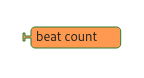

# Music Blocks-v4 Terminology

This document provides definitions for the key terms, technologies, and concepts related to the MusicBlocks-v4 project.

---

## Projects & Versions

- **MusicBlocks-v3**: MusicBlocks is a visual programming language that teaches music and coding by snapping blocks together and is built on a tech stack of vanilla JavaScript, HTML, and CSS.
- **MusicBlocks-v4**: MusicBlocks-v4 is a complete architectural overhaul of the platform using modern TypeScript and React, a necessary evolution to improve maintainability, enhance performance, and enable advanced new features.

- **Masonry Module**: A primary feature of MusicBlocks-v4 that allows users to construct music programs by dragging, dropping, and linking interactive blocks.

---

## Epics worked upon in the project:

1. **Brick**: The fundamental building block and the smallest unit of logic in MusicBlocks. Users connect bricks to create musical programs.

  

2. **Stack**: A vertically connected chain of bricks that represents a structured logic flow, executing sequentially or conditionally.

  

3. **Workspace**: The main interactive, grid-based canvas where users visually place, connect, and arrange bricks to build their programs.

  

4. **Palette**: A scrollable, categorized panel that displays all available bricks for users to preview, search, and drag into the workspace.

  

5. **Abstract Syntax Tree (AST)**: A hierarchical, tree-like data structure that represents the logical flow and structure of the program created by the user connecting bricks in the workspace. The `MusicBlocks-v4-lib` interpreter uses this tree to execute the program.

---

## Brick Types (in MusicBlocks-v4)

1. **Expression Brick**- These bricks can only be connected to the right notches of Simple and Compound Statement Bricks.

  

2. **Simple Statement Brick** - Simple Statement Bricks are bricks which allow bricks to be connected to its right notch and bottom notch.

  

3. **Complex Statement Brick** - Complex Statement Bricks are bricks which allow bricks to be connected to its right notch, bottom notch and nest other bricks.

  

---

## Technologies, Frameworks, & Tools

- **React**: A JavaScript library for building user interfaces. MusicBlocks-v4 is built with React, using functional components and hooks.
- **TypeScript**: A typed superset of JavaScript used to build MusicBlocks-v4 for improved code quality and maintainability.
- **Recoil**: A lightweight state management solution used in MusicBlocks-v4 to manage global state, such as the positions and properties of bricks on the workspace.
- **Vite**: A modern frontend build tool used in the MusicBlocks-v4 project for efficient development.
- **Jest / Vitest**: Testing frameworks used for writing and running unit tests. The proposal specifies using Vitest for its compatibility with Vite and TypeScript.
- **Storybook**: A development tool used to build, visualize, and test UI components (like bricks) in isolation from the main application.
